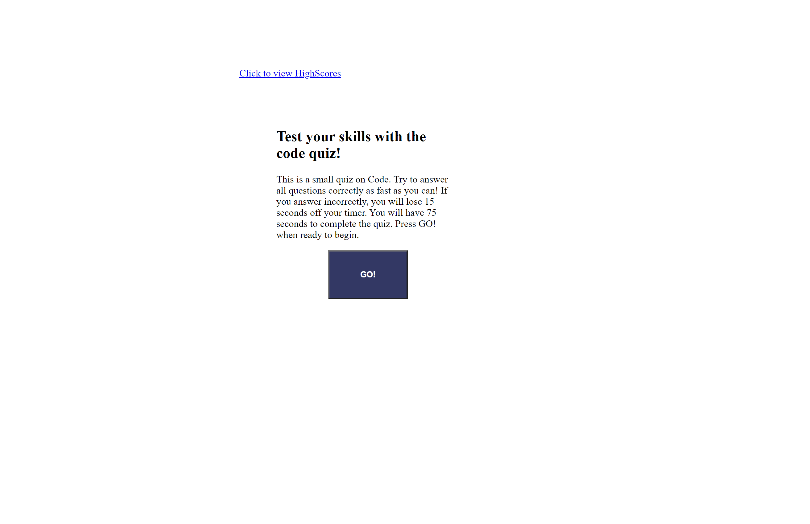

This homework assignment was a Code Quiz that involved using HTML, CSS, and JavaScript. It is designed so when you click the "GO!" button the timer for the quiz starts counting down. You have 75 seconds to complete the quiz and your time will be decremented by 15 seconds if you answer a question incorrectly. There are 5 questions each question containing 4 multiple choice answers to choose from. You will be notified if you answered the question correctly or incorrectly. At the end of the quiz the remaining time, (if there is any) will be turned into the Users score. The user will then be alerted, showing them their score for the quiz. Following that the user will be asked to enter their initials so that their score and initials can be saved to the "high scores" section. If the user does not enter any initials, they will be prompted to do so. The user will have the option of returning to the home page or to clear the high scores list." 

